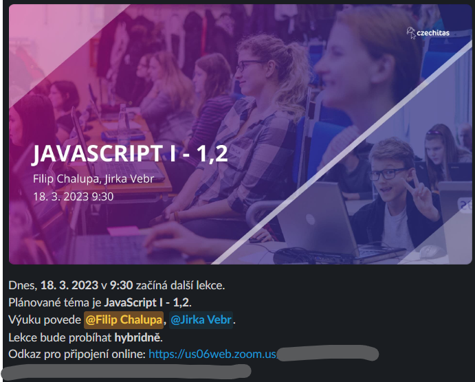

# DA: Web

Skript na přeposílání událostí z kalendáře v Google sheetu do Slacku a do e-mailu.

## Ukázka výstupu



## Spuštění

### Nastavení

Na základě ukázky v souboru [.env.example](./.env.example) je potřeba poskytnout proměnné prostředí. Buď vytvořením souboru `.env` v podobném formátu nebo jiným způsobem, například přes GitHub repository secrets.

### Instalace závislostí

```bash
npm ci
```

### Samotný start

Start je doporučen provádět každý den ráno. Nejpozději v čase před začátkém brzké lekce s rezervou aspoň několika minut.

```bash
npm run today-notification
```

Pro vygenerování souhrnu na další týden.

```bash
npm run weekly-notification
```

A pro nedělní vygenerování týdeníku.

```bash
npm run weekly-email-summary
```
